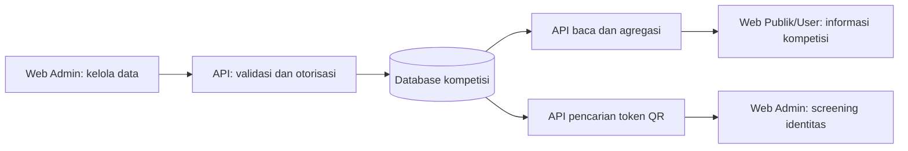
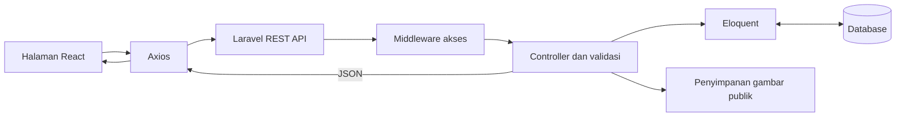

# Product Requirements Document — KBMLeague

| Atribut | Keterangan |
| --- | --- |
| Produk | KBMLeague |
| Versi dokumen | 1.1 |
| Tanggal | 8 Oktober 2026 |
| Status | Draf berdasarkan implementasi proyek saat ini |
| Platform | Aplikasi web untuk desktop dan mobile |
| Bahasa antarmuka | Bahasa Indonesia |

Dokumen ini menjelaskan kebutuhan produk, ruang lingkup, aturan bisnis, dan kriteria penerimaan KBMLeague. Bagian **kondisi saat ini** berasal dari kode proyek. Target kualitas dan usulan pengembangan tidak berarti sudah diterapkan atau sudah diuji.

## 1. Ringkasan produk

KBMLeague adalah portal pengelolaan dan informasi kompetisi sepak bola. Pengunjung dapat melihat tim, profil pemain, jadwal, hasil pertandingan, klasemen, dan leaderboard. Administrator mengelola data kompetisi melalui panel khusus, mencatat statistik pemain, serta mencari identitas pemain menggunakan pemindaian QR.

Nilai utama produk adalah menyediakan satu sumber informasi kompetisi dan menghitung klasemen serta rating dari data yang dicatat administrator. Pembaruan tampil ketika data diminta kembali; aplikasi saat ini tidak menyediakan pembaruan skor langsung melalui WebSocket atau langganan real-time.

## 2. Masalah dan tujuan

### 2.1 Masalah yang ditangani

- Informasi tim, pemain, pertandingan, dan statistik dapat tersebar di banyak catatan.
- Perhitungan klasemen dan rating manual membutuhkan waktu dan rawan kesalahan.
- Penyelenggara membutuhkan cara cepat untuk menemukan profil pemain saat screening.
- Penggemar membutuhkan portal yang mudah dibaca untuk mengikuti kompetisi.

### 2.2 Tujuan produk

1. Memusatkan data kompetisi dalam satu aplikasi.
2. Memudahkan administrator mencatat dan memperbarui data.
3. Menyediakan klasemen dan rating yang konsisten dengan aturan perhitungan.
4. Menyediakan informasi publik tanpa mewajibkan registrasi.
5. Menampilkan pengalaman yang modern, responsif, dan mudah dibaca.

### 2.3 Indikator keberhasilan yang diusulkan

| Indikator | Cara evaluasi |
| --- | --- |
| Ketepatan klasemen | Hasil aplikasi sama dengan perhitungan manual untuk skenario menang, seri, dan kalah |
| Ketepatan rating | Hasil sesuai rumus dan rata-rata statistik pemain |
| Kelengkapan alur admin | Admin dapat membuat tim, pemain, pertandingan, skor, dan statistik tanpa mengubah database secara manual |
| Pembatasan akses | Pengunjung dan pengguna biasa tidak dapat melakukan operasi admin melalui API |
| Kemudahan eksplorasi | Pengunjung dapat berpindah dari daftar tim/pemain ke detail dan kembali |
| Keberhasilan screening | QR valid menampilkan pemain yang sesuai; QR tidak dikenal menampilkan kegagalan yang jelas |

Baseline penggunaan, jumlah pengguna aktif, dan target bisnis numerik belum ditentukan. Evaluasi di atas adalah rencana validasi, bukan laporan hasil pengujian.

## 3. Pengguna dan hak akses

| Peran | Kebutuhan | Hak akses |
| --- | --- | --- |
| Pengunjung | Mengikuti kompetisi dan mengenali tim/pemain | Membaca seluruh halaman publik tanpa login |
| Pengguna terdaftar | Memiliki akun untuk mengakses aplikasi | Login, logout, dan akses publik; belum ada fitur khusus pengguna biasa |
| Administrator | Mengelola data dan melakukan screening | Akses publik, dashboard admin, perubahan data, upload, dan pencarian QR |

Registrasi selalu membuat pengguna biasa. Penetapan administrator menggunakan flag `is_admin` melalui pengelolaan backend/database; antarmuka pengelolaan peran belum tersedia.

### 3.1 Dua area web dalam satu produk

KBMLeague menyediakan **Web Publik/User** dan **Web Admin**. Keduanya mempunyai tujuan, navigasi, dan fitur berbeda, tetapi memakai REST API dan database yang sama.

Dalam implementasi saat ini, dua area tersebut berada dalam **satu aplikasi frontend React**, bukan dua aplikasi atau dua domain yang sudah dipisahkan. Web publik menggunakan `PublicLayout`, sementara web admin menggunakan `AdminLayout` pada prefix `/admin`. Login dan registrasi adalah halaman bersama untuk autentikasi.

| Aspek | Web Publik/User | Web Admin |
| --- | --- | --- |
| Tujuan | Menyajikan informasi dan perjalanan kompetisi | Mengelola sumber data dan operasional kompetisi |
| Pengguna | Pengunjung, pengguna terdaftar, dan admin | Akun dengan `is_admin = true` |
| Pintu masuk | `/` | `/admin`, diarahkan ke `/admin/dashboard` |
| Model interaksi | Membaca, mencari, memfilter, dan menjelajah | Membuat, memperbarui, menghapus, mengunggah, dan memindai |
| Navigasi | Navbar, menu mobile, footer, menu akun | Sidebar, menu mobile, breadcrumb, profil admin |
| Login | Tidak wajib untuk informasi publik | Wajib dengan token valid dan hak admin |
| Perubahan data kompetisi | Tidak tersedia | Tersedia sesuai modul pengelolaan |
| Sumber informasi | Data yang sudah tersimpan dari pengelolaan admin | Database yang sama dengan web publik |
| Pembaruan tampilan | Setelah request ulang, navigasi, atau refresh | Setelah simpan dan pemuatan ulang data terkait |
| Tema | Terang/gelap | Terang/gelap; memakai preferensi lokal yang sama |

### 3.2 Matriks fitur berdasarkan peran

Keterangan: **Ya** = akses tersedia; **Tidak** = tidak tersedia untuk peran tersebut; **Belum** = fitur belum tersedia di aplikasi.

| Fitur / tindakan | Pengunjung | User terdaftar | Admin |
| --- | --- | --- | --- |
| Membaca beranda dan ringkasan kompetisi | Ya | Ya | Ya |
| Membaca daftar/detail tim dan pemain | Ya | Ya | Ya |
| Mencari pemain dan memfilter posisi | Ya | Ya | Ya |
| Membaca jadwal, skor, klasemen, leaderboard | Ya | Ya | Ya |
| Memfilter status pertandingan | Ya | Ya | Ya |
| Mengubah tema tampilan | Ya | Ya | Ya |
| Registrasi akun biasa | Ya | Ya, melalui halaman registrasi | Ya, melalui halaman registrasi |
| Login dan logout | Login | Ya | Ya |
| Membuka dashboard admin | Tidak | Tidak | Ya |
| Menambah/edit/hapus tim dan pemain | Tidak | Tidak | Ya |
| Membuat pertandingan dan mengubah skor/status | Tidak | Tidak | Ya |
| Mengisi atau menghapus statistik pemain | Tidak | Tidak | Ya |
| Upload logo/foto | Tidak | Tidak | Ya |
| Membuat ulang token QR dan mencetak kartu | Tidak | Tidak | Ya |
| Screening QR melalui kamera | Tidak | Tidak | Ya |
| Mengatur peran akun melalui UI | Belum | Belum | Belum |
| Favorit, komentar, dan notifikasi personal | Belum | Belum | Belum |
| Mengedit profil akun atau mengganti password melalui UI | Belum | Belum | Belum |

Istilah **user** di dokumen ini berarti pengguna akun biasa. User tidak otomatis menjadi pemain, pengurus klub, atau administrator. Registrasi tidak membuat record `Player` atau `Team`.

## 4. Ruang lingkup

### 4.1 Termasuk dalam versi saat ini

- Beranda dengan ilustrasi lapangan dan ringkasan data kompetisi.
- Daftar/detail tim dan pemain.
- Jadwal dan hasil pertandingan dengan filter status.
- Klasemen dan empat kategori leaderboard.
- Registrasi, login, logout, serta pemeriksaan akun aktif.
- Dashboard dan pengelolaan tim, pemain, pertandingan, serta statistik oleh admin.
- Upload logo tim dan foto pemain.
- Pembuatan token QR, tampilan/cetak kartu pemain, dan screening melalui kamera.
- Pencarian pada daftar data admin.
- Tampilan responsif, mode terang/gelap, dan tipografi yang diperjelas.

### 4.2 Di luar ruang lingkup versi saat ini

- Pengelolaan beberapa liga, musim, atau turnamen terpisah.
- Live scoring, komentar langsung, dan notifikasi pertandingan.
- Tim favorit, like, komentar, serta interaksi sosial.
- Pembelian tiket, pembayaran, dan monetisasi.
- Login Google, verifikasi email, serta pemulihan password.
- Manajemen pengguna/peran melalui panel admin.
- Pendaftaran pemain oleh klub dan proses persetujuan berjenjang.
- Riwayat kehadiran atau keputusan kelayakan yang disimpan dari screening QR.
- Aplikasi mobile native, ekspor laporan, dan audit log.

## 5. Kebutuhan fungsional

### 5.1 Halaman publik

| ID | Fitur | Kebutuhan dan kriteria penerimaan |
| --- | --- | --- |
| PUB-01 | Beranda | Menampilkan hero ilustrasi lapangan, ringkasan jumlah tim/pemain/pertandingan/gol, jadwal, cuplikan klasemen, dan pemain unggulan berdasarkan API. Tidak menggunakan foto pemain terkenal sebagai latar |
| PUB-02 | Daftar tim | Menampilkan nama, logo atau inisial pengganti, dan informasi tim; pengunjung dapat membuka detail |
| PUB-03 | Detail tim | Menampilkan profil, skuad berdasarkan posisi, dan pertandingan yang melibatkan tim |
| PUB-04 | Daftar pemain | Mendukung pencarian dan filter posisi; hasil mengarah ke profil pemain |
| PUB-05 | Detail pemain | Menampilkan identitas, tim, posisi, rating, dan statistik pertandingan pemain |
| PUB-06 | Jadwal dan skor | Menampilkan peserta, waktu, venue, status, dan skor; mendukung filter status |
| PUB-07 | Klasemen | Menampilkan main, menang, seri, kalah, gol memasukkan/kebobolan, selisih gol, dan poin |
| PUB-08 | Leaderboard | Menampilkan lima teratas untuk gol, assist, rating, dan clean sheet kiper |
| PUB-09 | Navigasi | Tersedia akses antarhalaman, indikator halaman aktif, navigasi mobile, dan tautan akun |

### 5.2 Autentikasi dan otorisasi

| ID | Fitur | Kebutuhan dan kriteria penerimaan |
| --- | --- | --- |
| AUTH-01 | Registrasi | Menerima nama, email unik, password minimal delapan karakter, dan konfirmasi password. Akun baru bukan admin |
| AUTH-02 | Login | Kredensial valid menghasilkan akun dan token Sanctum. Admin diarahkan ke dashboard; pengguna biasa ke beranda |
| AUTH-03 | Logout | Token aktif dihapus di backend dan data akun lokal dibersihkan |
| AUTH-04 | Proteksi admin | Frontend memeriksa `/me`; backend memeriksa token dan `is_admin` pada seluruh operasi admin |
| AUTH-05 | Sesi tidak valid | Respons `401` membersihkan token lokal; pengguna di area admin diarahkan ke login. Akses pengguna nonadmin ke API admin menghasilkan `403` |

### 5.3 Panel administrator

| ID | Fitur | Kebutuhan dan kriteria penerimaan |
| --- | --- | --- |
| ADM-01 | Dashboard | Menampilkan total tim/pemain/fixture, pertandingan selesai/terjadwal, gol, assist, rata-rata rating, pertandingan terbaru, dan aksi cepat |
| ADM-02 | Tim | Menambah, mengedit, dan menghapus tim dengan nama, logo, tahun berdiri, dan deskripsi |
| ADM-03 | Pemain | Menambah, mengedit, dan menghapus pemain dengan tim, nama, posisi, nomor punggung, foto, tanggal lahir, tinggi, berat, rating, dan status aktif sesuai field yang tersedia |
| ADM-04 | Pertandingan | Membuat pertandingan dengan dua tim berbeda, waktu, venue, dan status; form edit saat ini berfokus pada skor dan status |
| ADM-05 | Statistik | Mencatat atau memperbarui statistik untuk pasangan pemain–pertandingan melalui form input; menyediakan penghapusan statistik |
| ADM-06 | Pencarian | Mencari data tim, pemain, pertandingan, dan statistik pada daftar admin serta menampilkan jumlah hasil |
| ADM-07 | Upload | Mengunggah gambar JPG/JPEG, PNG, atau WebP maksimal 2 MB; URL hasil digunakan untuk logo/foto |
| ADM-08 | QR pemain | Pemain baru memiliki token QR; admin dapat membuat ulang token dan membuka kartu untuk dicetak |
| ADM-09 | Screening | Kamera membaca token QR dan mengambil profil pemain. QR tidak dikenal atau izin kamera ditolak menghasilkan pesan yang jelas |

Backend mendukung `PUT /player-stats/{id}` dan perubahan field pertandingan yang lebih luas. Frontend belum menyediakan halaman edit statistik terpisah atau form lengkap untuk mengubah seluruh detail jadwal pertandingan.

### 5.4 Detail Web Publik/User per halaman

#### 5.4.1 Beranda — `/`

**Tujuan:** memberikan gambaran kompetisi dan jalur cepat menuju informasi utama.

- Hero berisi judul, deskripsi, ilustrasi lapangan, dan tautan menuju pertandingan serta klasemen.
- Kartu pertandingan berikutnya mengambil fixture berstatus `scheduled`. Jika jadwal kosong, tampilkan informasi bahwa pertandingan belum tersedia.
- Ringkasan menampilkan total tim, pemain, pertandingan, dan gol berdasarkan endpoint dashboard.
- Match center menampilkan maksimal tiga pertandingan terjadwal; jika tidak ada, tampilkan cuplikan pertandingan selesai.
- Cuplikan klasemen menampilkan maksimal empat tim dengan posisi, jumlah main, dan poin.
- Cuplikan pemain menampilkan maksimal tiga pencetak gol dan tiga pemain dengan rating tertinggi.
- Bagian eksplorasi menyediakan tautan ke daftar tim dan pemain.
- Keadaan gagal memuat data menyediakan pesan serta tombol coba lagi. Angka tidak diganti dengan data contoh.

**Penerimaan:** pengunjung dapat mengenali isi kompetisi dan masuk ke halaman terkait tanpa login; kondisi jadwal/statistik kosong tetap menghasilkan tampilan yang informatif.

#### 5.4.2 Daftar tim — `/teams`

**Tujuan:** membantu pengunjung menemukan klub yang berpartisipasi.

- Menampilkan tim dari database, termasuk identitas dan logo jika tersedia.
- Logo yang belum tersedia diganti dengan inisial yang tetap memungkinkan tim dikenali.
- Menampilkan informasi jumlah pemain sesuai data yang tersedia.
- Tim dapat dipilih untuk membuka `/teams/:id`.
- Halaman menyediakan keadaan loading, gagal, dan kosong sesuai kebutuhan UX. Pencarian tim publik bukan fitur yang dinyatakan tersedia dalam versi saat ini.

#### 5.4.3 Detail tim — `/teams/:id`

- Menampilkan nama, logo, tahun berdiri, deskripsi, serta jumlah anggota skuad.
- Menampilkan skuad yang dikelompokkan menurut posisi.
- Menampilkan pertandingan yang melibatkan tim sebagai peserta home atau away.
- Memperlihatkan hasil/status pertandingan dan tautan profil pemain yang tersedia.
- Menyediakan tautan kembali ke daftar tim dan penanganan tim tidak ditemukan.

**Penerimaan:** seluruh pemain dan fixture pada halaman mengacu pada tim yang dipilih; data dari klub lain tidak tercampur.

#### 5.4.4 Daftar pemain — `/players`

- Menampilkan identitas pemain, tim, posisi, foto atau pengganti foto, serta rating sesuai kartu yang tersedia.
- Pencarian backend mencocokkan nama pemain, posisi, atau nama tim.
- Filter posisi mempersempit daftar; tombol reset mengembalikan pilihan pencarian/filter.
- Menampilkan jumlah pemain dari hasil yang dimuat.
- Membuka `/players/:id` saat pemain dipilih.

**Penerimaan:** pencarian dan filter menghasilkan pemain yang sesuai; tidak ada hasil harus dibedakan dari kegagalan API.

#### 5.4.5 Detail pemain — `/players/:id`

- Menampilkan identitas, foto, klub, posisi, nomor punggung, dan rating keseluruhan.
- Menggunakan atribut profil yang tersedia, seperti tanggal lahir, tinggi, dan berat.
- Memuat statistik yang difilter berdasarkan `player_id`.
- Menampilkan ringkasan/riwayat performa dari data pemain tersebut dan tautan navigasi terkait.
- Menyediakan penanganan pemain tidak ditemukan dan tautan kembali.

**Batas akses:** halaman ini untuk membaca informasi pemain; user tidak dapat mengedit profil pemain atau mencatat statistik dari web publik.

#### 5.4.6 Jadwal dan skor — `/fixtures`

- Menampilkan nama peserta, waktu pertandingan, venue, status, serta skor jika tersedia.
- Filter mencakup seluruh pertandingan, `scheduled`, dan `completed`.
- Urutan data API mengikuti waktu pertandingan dari yang paling awal.
- Fixture terjadwal tidak dipresentasikan sebagai hasil akhir.
- Tidak menyediakan tombol edit skor bagi pengunjung maupun user biasa.

#### 5.4.7 Klasemen — `/league-table`

- Menampilkan posisi dan identitas tim beserta main, menang, seri, kalah, gol memasukkan, gol kebobolan, selisih gol, dan poin.
- Peringkat mengikuti aturan pada bagian 6.2.
- Nama tim mengarah ke profil klub jika tautannya tersedia pada tabel.
- Tabel dapat digeser horizontal di layar kecil; data tetap terbaca.
- Belum menyediakan pemilih musim atau liga terpisah.

#### 5.4.8 Leaderboard — `/leaderboard`

- Memisahkan kategori top scorer, assist, rating, dan clean sheet kiper.
- Menampilkan peringkat, pemain, tim, serta nilai kategori yang sesuai.
- Profil pemain dapat dibuka melalui nama pemain.
- Kategori tanpa data menampilkan pesan kosong, bukan pemain contoh.
- Syarat peserta dan aturan pembeda mengikuti bagian 6.4.

#### 5.4.9 Akun user — `/register` dan `/login`

- Registrasi memakai nama, email, password, dan konfirmasi password.
- Login memakai email/password; tidak memerlukan email Gmail secara khusus dan bukan login OAuth Google.
- Setelah login, menu akun menampilkan identitas akun dan tindakan logout.
- User biasa kembali ke beranda; admin mendapatkan akses menuju panel admin.
- Login tidak membuka fitur favorit, notifikasi, komentar, atau edit akun yang belum tersedia.

### 5.5 Detail Web Admin per modul

#### 5.5.1 Dashboard — `/admin/dashboard`

**Tujuan:** menyediakan ringkasan operasional dan akses cepat ke pekerjaan admin.

- Menampilkan sapaan berdasarkan akun, ringkasan tim/pemain, laga selesai dibanding total laga, gol, dan assist.
- Menampilkan rata-rata rating serta daftar maksimal lima fixture terbaru menurut waktu pertandingan. Daftar ini tidak terbatas pada pertandingan selesai.
- Aksi cepat menuju tambah tim, tambah pemain, buat pertandingan, dan input statistik.
- Tautan metrik menuju daftar pengelolaan yang relevan.
- Data ringkasan berasal dari backend, bukan angka yang diisi manual pada UI.

#### 5.5.2 Pengelolaan tim

| Halaman | URL | Tindakan |
| --- | --- | --- |
| Daftar tim | `/admin/teams` | Melihat, mencari nama klub, membuka edit, dan menghapus |
| Tambah tim | `/admin/teams/create` | Mengisi profil klub dan mengunggah logo |
| Edit tim | `/admin/teams/:id/edit` | Memuat data tersimpan dan memperbarui profil |

Field inti: nama wajib; logo, tahun berdiri, dan deskripsi bersifat opsional sesuai validasi backend. Upload logo menghasilkan URL yang digunakan saat form disimpan.

**Penerimaan:** penyimpanan berhasil mengarahkan ke daftar; perubahan tampil pada profil publik setelah dimuat ulang. Sebelum penghapusan, admin diberi konfirmasi tentang dampak pada pemain/data terkait.

#### 5.5.3 Pengelolaan pemain

| Halaman | URL | Tindakan |
| --- | --- | --- |
| Daftar pemain | `/admin/players` | Mencari nama/tim/posisi, edit, hapus, membuat ulang QR, membuka kartu |
| Tambah pemain | `/admin/players/create` | Memilih tim dan mengisi atribut pemain |
| Edit pemain | `/admin/players/:id/edit` | Memperbarui data pemain yang dipilih |

- Data inti: tim, nama, posisi, dan nomor punggung wajib sesuai backend.
- Atribut tambahan: foto, tanggal lahir, tinggi, berat, rating, dan status aktif sesuai field form/API yang tersedia.
- Tim pilihan diambil dari tim yang sudah tersimpan.
- Pemain baru mendapatkan token QR otomatis.
- Pembuatan ulang QR adalah tindakan eksplisit admin; token lama diganti.
- Kartu pemain dapat dibuka sebagai pratinjau dan dicetak; ketergantungan gambar QR eksternal tetap perlu diuji.

**Penerimaan:** profil yang dibuat muncul di web publik; pemindahan tim tidak membuat pemain baru. Perilaku riwayat statistik saat pemain pindah tim memerlukan keputusan bisnis lanjutan.

#### 5.5.4 Pengelolaan pertandingan

| Halaman | URL | Tindakan |
| --- | --- | --- |
| Daftar pertandingan | `/admin/fixtures` | Mencari peserta/venue/status, membaca skor, edit, dan hapus |
| Buat pertandingan | `/admin/fixtures/create` | Memilih tim home/away, tanggal/waktu, venue, dan status |
| Edit skor/status | `/admin/fixtures/:id/edit` | Mencatat atau mengoreksi kedua skor dan status |

- Pembuatan pertandingan membutuhkan minimal dua tim yang berbeda.
- Venue opsional; status dan waktu mengikuti validasi backend.
- Form edit yang ada bukan editor lengkap perubahan peserta/tanggal/venue.
- Penyimpanan status `completed` wajib mempunyai kedua skor.
- Penghapusan fixture berdampak pada statistik fixture tersebut.

**Penerimaan:** fixture muncul di jadwal publik dan, jika selesai, memengaruhi klasemen. Mengubah skor fixture tidak otomatis mengubah statistik gol individu.

#### 5.5.5 Pengelolaan statistik pemain

| Halaman | URL | Tindakan |
| --- | --- | --- |
| Daftar statistik | `/admin/player-stats` | Mencari nama pemain/tim/ID laga, membaca statistik/rating, dan menghapus |
| Input statistik | `/admin/player-stats/create` | Memilih fixture/pemain, mengisi metrik, lalu menyimpan |

- Statistik terikat pada fixture, pemain, dan tim yang sesuai.
- Menit bermain dibatasi 0–120; akurasi operan 0–100; angka metrik tidak negatif sesuai validasi.
- Rating dihitung backend; input statistik bukan tempat memasukkan rating pertandingan secara bebas.
- Input ulang pasangan pemain–fixture memperbarui catatan melalui backend.
- Tidak ada halaman edit statistik terpisah. Backend menyediakan endpoint update untuk pengembangan UI berikutnya.

**Penerimaan:** statistik valid memperbarui rating pemain serta agregasi leaderboard/dashboard setelah data diminta ulang; penghapusan melalui controller menghitung ulang rating.

#### 5.5.6 Screening pemain — `/admin/screening`

- Meminta izin kamera dan memakai kamera belakang jika perangkat mendukung.
- Memindai token QR kartu pemain.
- Menghentikan kamera setelah pembacaan berhasil lalu meminta profil melalui API khusus admin.
- Menampilkan data pemain untuk pemeriksaan identitas oleh petugas.
- Memungkinkan reset untuk memindai pemain berikutnya.
- Memberi pesan ketika akses kamera ditolak, QR tidak ditemukan, atau request gagal.

**Batas fungsi:** tampilan identitas tidak berarti sistem telah memberi persetujuan bermain. Tidak ada penyimpanan screening, absensi, validasi umur kompetisi, maupun keputusan kelayakan otomatis.

#### 5.5.7 Fitur bersama Web Admin

- Sidebar menandai modul aktif dan menyediakan navigasi mobile.
- Breadcrumb menunjukkan modul serta konteks tambah/edit data.
- Tombol melihat website mengembalikan admin ke area publik.
- Menu akun menampilkan nama administrator dan logout.
- Pencarian daftar admin memfilter data yang sudah dimuat di frontend; bukan pagination/search global seluruh database.
- Loading, tombol simpan nonaktif saat proses, error, serta konfirmasi penghapusan adalah kebutuhan UX setiap operasi relevan.

### 5.6 Hubungan fitur admin dengan informasi publik

| Tindakan Web Admin | Data yang berubah | Dampak pada Web Publik/User |
| --- | --- | --- |
| Tambah/edit tim | `teams` | Identitas klub di daftar/detail, pertandingan, dan klasemen ikut berubah |
| Tambah/edit pemain | `players` | Daftar/profil pemain dan skuad klub menggunakan data baru |
| Upload logo/foto lalu simpan form | URL gambar pada tim/pemain | Logo atau foto baru ditampilkan |
| Buat fixture | `fixtures` | Jadwal dan kartu pertandingan beranda mengambil fixture tersebut |
| Simpan skor dan status selesai | Skor/status fixture | Hasil pertandingan dan perhitungan klasemen berubah |
| Input/update statistik | `player_stats` dan rating pemain | Riwayat performa, rating, gol/assist agregat, dan leaderboard berubah |
| Hapus statistik melalui controller | Statistik dan rating dihitung ulang | Ringkasan pemain dan leaderboard mengambil hasil terbaru |
| Buat ulang token QR | `players.qr_code` | Mengubah kartu dan pencarian screening; bukan tindakan publik |
| Hapus tim/pemain/fixture | Record dan relasi yang terkena cascade | Data terkait tidak lagi tersedia; konsistensi rating akibat cascade perlu diperiksa |

Perubahan admin tersimpan pada database yang sama. Pengunjung yang sedang membuka halaman tidak selalu langsung melihat perubahan karena belum ada push update. Pengunjung perlu memuat ulang halaman/data.



### 5.7 User stories dan prioritas

P0 adalah kemampuan inti versi saat ini; P1 adalah penyempurnaan penting. Status tidak menyatakan bahwa seluruh skenario sudah lolos pengujian.

| ID | Area | User story | Prioritas | Status |
| --- | --- | --- | --- | --- |
| US-01 | Publik | Sebagai pengunjung, saya ingin melihat jadwal dan hasil agar bisa mengikuti kompetisi | P0 | Tersedia |
| US-02 | Publik | Sebagai pengunjung, saya ingin melihat klasemen agar memahami persaingan tim | P0 | Tersedia |
| US-03 | Publik | Sebagai pengunjung, saya ingin membuka profil tim dan pemain agar mengenali peserta | P0 | Tersedia |
| US-04 | Publik | Sebagai pengunjung, saya ingin mencari pemain menurut nama/posisi agar cepat menemukannya | P0 | Tersedia |
| US-05 | User | Sebagai pengguna, saya ingin login/logout agar dapat menggunakan akun saya | P0 | Tersedia |
| US-06 | Admin | Sebagai admin, saya ingin mengelola tim dan pemain agar data peserta akurat | P0 | Tersedia |
| US-07 | Admin | Sebagai admin, saya ingin mencatat hasil pertandingan agar klasemen dihitung otomatis | P0 | Tersedia |
| US-08 | Admin | Sebagai admin, saya ingin mengisi statistik agar performa pemain tercatat | P0 | Tersedia |
| US-09 | Admin | Sebagai petugas admin, saya ingin memindai QR agar dapat menemukan identitas pemain | P0 | Tersedia; perangkat dan kartu perlu diverifikasi |
| US-10 | Admin | Sebagai admin, saya ingin mengedit seluruh detail jadwal dan statistik dari halaman khusus | P1 | Belum lengkap |
| US-11 | User | Sebagai pengguna, saya ingin mengganti password atau memulihkan akun | P1 | Belum tersedia |
| US-12 | Admin | Sebagai admin, saya ingin melihat riwayat perubahan agar dapat menelusuri koreksi data | P1 | Belum tersedia |

### 5.8 Kriteria penerimaan lintas dua web

1. Pengunjung tanpa token dapat membuka seluruh halaman publik, tetapi tidak dapat membuka panel admin sebagai admin.
2. Registrasi tidak mengubah hak akses menjadi admin dan tidak menghasilkan profil pemain otomatis.
3. User biasa yang mencoba `/admin/*` dialihkan; request langsung ke API admin tetap ditolak oleh backend.
4. Admin dapat beralih ke website publik, melihat hasil pengelolaan, lalu kembali ke panel melalui menu akun.
5. Tim/pemain baru tampil di daftar publik setelah data dimuat ulang.
6. Fixture `scheduled` tampil di jadwal, tetapi tidak menambah main atau poin klasemen.
7. Fixture `completed` dengan skor valid memengaruhi klasemen sesuai aturan pertandingan.
8. Input statistik memperbarui performa publik sesuai rumus dan cakupan agregasi yang terdokumentasi.
9. Pembuatan ulang QR membuat token sebelumnya tidak lagi cocok; kemampuan baca data publik tetap terpisah dari akses screening admin.
10. Keadaan kosong/gagal ditampilkan secara jelas pada kedua area; data sensitif akun, terutama password, tidak masuk respons publik.
11. Tata letak mobile, mode gelap, fokus keyboard, dan kontras perlu diuji pada kedua area secara terpisah.

## 6. Aturan bisnis

### 6.1 Tim dan pemain

- Pemain harus terkait dengan tim yang terdaftar.
- Posisi yang digunakan antarmuka: `Goalkeeper`, `Defender`, `Midfielder`, dan `Forward`.
- Rating pemain dibatasi pada rentang 0–10; nilai awal dalam skema adalah 6,00.
- Token QR tersimpan unik pada pemain. Pembuatan ulang mengganti token sebelumnya.
- Foreign key menggunakan penghapusan berantai: penghapusan tim dapat menghapus pemain, pertandingan, dan statistik terkait. Penghapusan pemain/fixture menghapus statistik terkait.

### 6.2 Pertandingan dan klasemen

- Status pertandingan: `scheduled` atau `completed`.
- Pertandingan melibatkan dua tim berbeda yang sudah terdaftar.
- Skor berupa bilangan bulat tidak negatif. Pertandingan `completed` harus memiliki kedua skor.
- Klasemen dihitung dari fixture `completed`; tidak disimpan sebagai tabel klasemen terpisah.
- Menang memperoleh 3 poin, seri 1 poin, kalah 0 poin.
- Selisih gol = gol memasukkan − gol kebobolan.
- Urutan klasemen: poin tertinggi, lalu selisih gol tertinggi, lalu gol memasukkan tertinggi.
- Jika ketiga nilai sama, belum ada aturan pembeda tambahan yang eksplisit.

### 6.3 Statistik dan rating

Statistik meliputi gol, assist, menit bermain, tembakan, tembakan tepat sasaran, akurasi operan, tekel, intersepsi, dribel sukses, penyelamatan, clean sheet, kartu kuning/merah, dan gol bunuh diri.

Tim dalam statistik harus sama dengan tim pemain dan menjadi salah satu peserta fixture. Input untuk pasangan `fixture_id`–`player_id` yang sama memperbarui catatan melalui `updateOrCreate`.

Rumus rating pertandingan saat ini:

```text
rating = 6,00
       + (gol × 1,00)
       + (assist × 0,50)
       + (clean sheet ? 0,50 : 0)
       + (penyelamatan × 0,10)
       − (kartu kuning × 0,30)
       − (kartu merah × 1,00)
       − (gol bunuh diri × 1,00)

rating akhir = pembulatan dua desimal, dibatasi 0–10
overall_rating = rata-rata rating pertandingan pemain
```

Ketika statistik dibuat, diperbarui, atau dihapus melalui controller statistik, rating keseluruhan dihitung ulang. Jika tidak ada statistik tersisa, nilainya kembali ke 6,00. Field statistik lain saat ini tidak memengaruhi rumus rating. Rating ini merupakan aturan produk, bukan model analitik yang telah divalidasi secara ilmiah.

### 6.4 Leaderboard

- Gol dan assist dijumlahkan berdasarkan pasangan pemain–tim. Nilai nol tidak masuk leaderboard kategori tersebut.
- Jika gol/assist sama, total menit bermain yang lebih sedikit mendapat urutan lebih tinggi.
- Rating menggunakan `players.overall_rating` dengan nilai lebih dari nol; pemain tanpa statistik dapat tetap muncul dengan rating awal.
- Clean sheet dihitung dari statistik pemain berposisi `Goalkeeper` dan harus lebih dari nol.
- Tiap kategori dibatasi lima hasil.
- Agregasi statistik saat ini tidak membatasi fixture hanya pada status `completed` dan tidak memisahkan musim.

## 7. Alur utama

### 7.1 Pengunjung mengikuti kompetisi

1. Membuka beranda dan melihat ringkasan kompetisi.
2. Membuka jadwal, klasemen, atau leaderboard.
3. Membuka detail tim/pemain melalui tautan yang tersedia.
4. Menggunakan filter untuk mempersempit informasi tanpa login.

### 7.2 Administrator menyiapkan kompetisi

1. Login dengan akun admin.
2. Membuat tim dan mengunggah logo jika diperlukan.
3. Membuat pemain pada tim yang sesuai dan mengunggah foto.
4. Membuat pertandingan dengan peserta, waktu, dan venue.
5. Mengisi skor dan mengubah status menjadi `completed` setelah pertandingan selesai.
6. Mengisi statistik individu sesuai peserta pertandingan.
7. Memeriksa hasil di klasemen, rating, dan leaderboard setelah data dimuat kembali.

Skor fixture dan gol dalam statistik individu dicatat secara terpisah. Implementasi saat ini tidak otomatis menyamakan jumlah gol statistik dengan skor fixture.

### 7.3 Screening pemain

1. Admin membuka kartu pemain yang memiliki QR.
2. Membuka halaman screening dan memberi izin kamera.
3. Memindai QR; kamera berhenti setelah pembacaan berhasil.
4. Sistem mencari pemain berdasarkan token dan menampilkan profilnya.
5. Admin dapat memulai pemindaian berikutnya.

Screening saat ini merupakan pencarian identitas. Pemindaian tidak menyimpan kehadiran, hasil pemeriksaan, atau persetujuan kelayakan pemain.

## 8. Kebutuhan pengalaman pengguna

- Menggunakan aksen hijau, latar yang ringan, dan hierarki informasi yang konsisten.
- Hero publik menggunakan ilustrasi lapangan, bukan gambar pemain terkenal.
- Font Segoe UI dengan fallback Helvetica Neue/Arial; teks, tabel, dan form harus terbaca jelas.
- Menyediakan mode terang/gelap dan menyimpan preferensi tema secara lokal.
- Navigasi mobile dapat dibuka/ditutup; halaman tabel menyediakan scroll horizontal saat diperlukan.
- Menampilkan keadaan loading, kosong, berhasil, dan gagal sesuai konteks.
- Form menandai field wajib, mempertahankan nilai input saat gagal, dan mencegah pengiriman ganda saat menyimpan.
- Elemen interaktif memiliki label yang jelas dan indikator fokus keyboard.

Butir UX merupakan kriteria penerimaan menyeluruh. Keseragaman penanganan error dan aksesibilitas seluruh halaman masih perlu diverifikasi langsung di browser.

## 9. Model data dan arsitektur

| Entitas | Data utama | Relasi |
| --- | --- | --- |
| User | Nama, email, password hash, `is_admin` | Memiliki token akses Sanctum |
| Team | Nama, logo, tahun berdiri, deskripsi | Memiliki banyak pemain |
| Player | Tim, identitas, posisi, nomor punggung, foto, rating, status aktif, QR | Milik satu tim; dirujuk statistik |
| Fixture | Tim home/away, waktu, venue, status, skor | Memiliki dua peserta; dirujuk statistik |
| PlayerStat | Fixture, pemain, tim, metrik performa, rating | Menghubungkan pemain dan tim pada pertandingan |



- Frontend: React 19, Vite, React Router, Tailwind CSS, Axios, Lucide, dan `html5-qrcode`.
- Backend: Laravel 12, PHP 8.2+, Sanctum, dan Eloquent.
- Database mengikuti `DB_*`; contoh konfigurasi menggunakan SQLite, dan lingkungan lokal dapat memakai MySQL/MariaDB.
- API frontend menggunakan `VITE_API_BASE_URL` atau default `http://127.0.0.1:8000/api`.
- Token dikirim melalui `Authorization: Bearer ...` dan saat ini disimpan di `localStorage`.
- Logo/foto disimpan pada disk `public` Laravel, diakses melalui `/storage` setelah `storage:link`.
- Seeder tidak memasukkan data contoh pada instalasi baru.

### 9.1 Kelompok endpoint

| Akses | Endpoint utama |
| --- | --- |
| Publik | `GET /teams`, `/teams/{id}`, `/players`, `/players/{id}`, `/fixtures`, `/fixtures/{id}`, `/player-stats`, `/player-stats/{id}`, `/league-table`, `/leaderboard`, `/dashboard-stats` |
| Autentikasi | `POST /register`, `POST /login` |
| Token valid | `GET /me`, `POST /logout` |
| Admin | `POST/PUT/DELETE` tim, pemain, fixture, dan statistik; `POST /upload`; `POST /players/{id}/generate-qr`; `GET /players/by-qr/{token}` |

Semua endpoint di atas memiliki prefix `/api`. Detail route sumber: [backend/routes/api.php](backend/routes/api.php).

## 10. Kebutuhan nonfungsional dan operasional

| Area | Kebutuhan / target validasi |
| --- | --- |
| Keamanan akses | Pembatasan admin ditegakkan backend; password di-hash; data password tidak ikut respons akun |
| Integritas | Validasi tipe, rentang, keberadaan relasi, dan aturan peserta pertandingan dijalankan backend |
| Responsivitas | Alur utama dapat digunakan pada lebar layar sekitar 360 px hingga desktop; tabel tidak merusak layout |
| Aksesibilitas | Navigasi keyboard, label field, fokus terlihat, dan kontras teks perlu diuji; belum ada klaim kepatuhan formal |
| Kinerja | Usulan awal: respons baca utama p95 ≤ 1 detik pada dataset pengujian yang disepakati; belum diukur |
| Keandalan | Kesalahan API tidak menampilkan data contoh sebagai data nyata; menyediakan pesan dan retry yang sesuai |
| Operasional | Database dan server API harus tersedia; konfigurasi frontend, origin/CORS, dan URL storage sesuai lingkungan |
| Kamera | Screening memerlukan perangkat berkamera, izin pengguna, dan secure context seperti HTTPS atau localhost |
| Distribusi | Build produksi berhasil; hosting SPA menangani URL React Router dan backend melayani API/storage |

Target kinerja, konfigurasi produksi, backup, dan pengujian perangkat belum menjadi hasil yang terverifikasi dalam dokumen ini.

## 11. Skenario penerimaan utama

| ID | Skenario | Hasil yang diharapkan |
| --- | --- | --- |
| AC-01 | Instalasi baru tanpa data | Halaman publik menampilkan keadaan kosong, bukan informasi palsu |
| AC-02 | Registrasi email duplikat atau password tidak terkonfirmasi | Backend menolak dengan pesan validasi |
| AC-03 | Pengguna biasa memanggil API tulis | Tidak dapat mengubah data; token valid nonadmin mendapat `403` |
| AC-04 | Fixture selesai tanpa salah satu skor | Penyimpanan ditolak dengan `422` |
| AC-05 | Tim A menang 2–1 atas B | A: 3 poin, selisih +1; B: 0 poin, selisih −1 |
| AC-06 | Fixture seri 1–1 | Kedua tim memperoleh 1 poin dan selisih gol 0 |
| AC-07 | Statistik 1 gol, 1 assist, 1 kartu kuning | Rating menjadi 7,20 |
| AC-08 | Rating pertandingan 7,20 dan 8,00 | Overall rating menjadi 7,60 |
| AC-09 | Input ulang pemain–fixture yang sama | Catatan diperbarui, bukan ditambah sebagai catatan baru |
| AC-10 | Pemain bukan peserta fixture | Penyimpanan statistik ditolak |
| AC-11 | Gambar lebih dari 2 MB atau format tidak didukung | Upload ditolak |
| AC-12 | QR tidak dikenal | Tidak menampilkan identitas lain; menampilkan pemain tidak ditemukan |
| AC-13 | QR dibuat ulang | Token lama tidak lagi menemukan pemain tersebut |
| AC-14 | Penghapusan data berelasi | Dampak sesuai foreign key; pengguna mendapat konfirmasi yang memadai sebelum penghapusan |
| AC-15 | Mobile dan mode gelap | Navigasi, teks, form, dan tabel tetap dapat digunakan |

## 12. Keterbatasan dan pekerjaan lanjutan

Temuan berikut berasal dari peninjauan implementasi, bukan perubahan yang dilakukan melalui PRD ini:

1. **Kartu QR bergantung pada layanan gambar eksternal.** Kode memakai URL Google Charts; ketersediaan tampilan/cetak perlu diverifikasi. Generator lokal dapat dipertimbangkan.
2. **Penghapusan berantai tidak melalui controller statistik.** Perhitungan ulang rating setelah pemain/fixture/tim terkait dihapus perlu ditinjau agar nilai yang tersisa konsisten.
3. **Skor fixture dan statistik gol independen.** Dibutuhkan keputusan produk mengenai validasi kesesuaian dan koreksi hasil pertandingan.
4. **Rating awal dapat masuk leaderboard.** Perlu diputuskan apakah pemain wajib memiliki statistik/menit bermain sebelum masuk ranking.
5. **Data belum dipisahkan berdasarkan musim.** Seluruh fixture/statistik masuk agregasi yang sama.
6. **Belum ada pagination pada daftar utama.** Kinerja perlu dievaluasi ketika volume data bertambah.
7. **Token berada di localStorage.** Evaluasi mekanisme sesi, masa berlaku token, dan mitigasi XSS diperlukan sebelum produksi.
8. **Penanganan error tidak seragam.** Sebagian halaman masih menggunakan log konsol atau dialog bawaan browser.
9. **Pengelolaan admin masih manual.** Belum ada alur UI untuk penetapan/pencabutan peran.

### 12.1 Usulan prioritas berikutnya

| Prioritas | Usulan | Manfaat |
| --- | --- | --- |
| P1 | Pengujian alur pertandingan, rating, dan penghapusan berantai | Menjaga konsistensi hasil kompetisi |
| P1 | Verifikasi/generator QR lokal dan uji screening perangkat | Mengurangi ketergantungan dan kegagalan operasional |
| P1 | Perbaikan validasi/error, sesi, dan review akses produksi | Meningkatkan keandalan penggunaan |
| P2 | Edit statistik lengkap, edit jadwal lengkap, dan pagination | Memudahkan koreksi dan mendukung data lebih banyak |
| P2 | Audit log serta pengelolaan pengguna/peran | Memudahkan penelusuran perubahan |
| P3 | Liga/musim terpisah, laporan, dan notifikasi | Memperluas cakupan produk |

Prioritas tersebut merupakan usulan, bukan komitmen rilis. Jadwal, penanggung jawab, kapasitas, serta target skala perlu disepakati.

## 13. Sumber proyek

- [README.md](README.md): ringkasan dan panduan operasional.
- [frontend/src/App.jsx](frontend/src/App.jsx): halaman dan routing.
- [frontend/src/pages](frontend/src/pages): implementasi halaman publik/admin.
- [frontend/src/services/api.js](frontend/src/services/api.js): komunikasi API dan token.
- [backend/routes/api.php](backend/routes/api.php): endpoint dan hak akses.
- [backend/app/Http/Controllers](backend/app/Http/Controllers): validasi serta aturan bisnis.
- [backend/database/migrations](backend/database/migrations): skema dan penghapusan berantai.

PRD ini perlu diperbarui ketika aturan kompetisi, hak akses, ruang lingkup, atau implementasi produk berubah.
